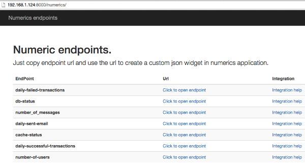
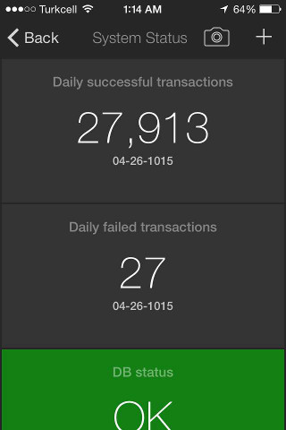
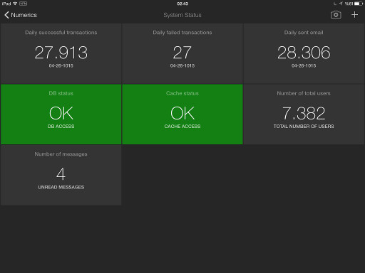
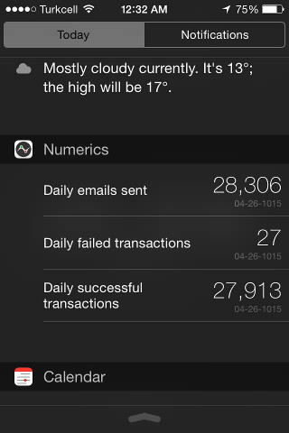

.. django-numerics documentation master file, created by
   sphinx-quickstart on Sun Apr 19 14:51:06 2015.
   You can adapt this file completely to your liking, but it should at least
   contain the root `toctree` directive.

Welcome to django-numerics's documentation!
===========================================

Give your app a mobile dashboard.

django-numerics is a numerics dashboard endpoint provider for django.

What is numerics
----------------
Numerics is a dashboard application for your mobile phone and tablet.
http://cynapse.com/numerics/

What is django-numerics
-----------------------
django-numerics is a django application that provides 2 things. An easy interface to create endpoints for numerics custom json widgets. Provides a user interface that lists all the endpoints that current user have access to.

Interface also provides an integration guide that specialized for each endpoint.

Why this is helpful
-------------------
Every project has some data that needs to be checked daily. But opening some web page to check the status is not a really nice interface. With numerics dashboard and django-numerics, it is very easy to have a very slick status dashboard on your mobile phone. Your data will be available whenever you want, where ever you want. Here is what you will get with almost no efford.

1) Your project will have a dashboard on mobile devices

and tablets

2) You can show your data on *today screen* of your mobile phone and tablet. At last, today screen will have data that you actually care.

3) You can receive notification when certain widget data is changed.

.. image:: _static/notification.jpg

4) If you have an apple watch you can show your data on your watch.

Install django-numerics
-----------------------
django-numerics can be installed using pip.

.. code-block:: bash

   $ pip install django-numerics

Or source code can be downloaded from github.

Integration
-----------
1) To use django-numerics in a project first add it to INSTALLED_APPS in your project's settings.py file.

.. code-block:: python

   INSTALLED_APPS = (
       'django.contrib.admin',
       'django.contrib.auth',
       ...
       # add djangonumerics to installed apps
       'djangonumerics',
   )

2) Add following settings to your project's settings.py file.

.. code-block:: python

        # for more info about django numeric settings:
        # http://django-numerics.readthedocs.org/en/latest/#django-numerics-settings
        DJANGO_NUMERICS_SALT='salt',
        DJANGO_NUMERICS_SECRET_KEY= '_i7QFz8nH19camV1PTono1ruXNtdOCPPQRZo22ckZXg=',
        DJANGO_NUMERICS_SERIALIZER_BACKEND = \
            'djangonumerics.serializers.CryptoSerializer'

3) Go to main urls file and add django-numerics endpoints to url patterns

.. code-block:: python

   urlpatterns = patterns(
       '',
       url(r'', include(core.urls)),
       url(r'^admin/', include(admin.site.urls)),
       url(r'^accounts/', include(accounts.urls)),
       ## add django-numerics to urls.py
       url(r'^numerics/', include(djangonumerics.urls)),
   )

4) Register some endpoints for your dashboard. For instance following code adds number of users as an endpoint.

.. code-block:: python

    from djangonumerics import NumberResponse
    from djangonumerics import register

    def total_users(user):
        """Return total number of users."""
        user_count = User.objects.filter(is_active=True).count()
        return NumberResponse(user_count, 'Total number of users')

    # register endpoint to django-numerics
    register('total-users', total_users, NumberResponse)

After endpoint registration, open http://localhost:8000/numerics to see list of endpoints for current user. You will also find instructions about how to integrate those endpoints. When you open the url, make sure that you are logged in with a user. If there is no logged in user, you will get a 404. This behavior can be changed by providing a new permission function. See permission section for more information.

django-numerics settings
========================

DJANGO_NUMERICS_SALT (Mandatory)
-----------------------------------------

Salt is used in creating md5 of the endpoint names. It is also usefull to have project specific urls, if you are using basic serializer.

DJANGO_NUMERICS_SECRET_KEY (Mandatory for crypto serializer)
------------------------------------------------------------

Hexedecimal value that will be used by crypto serializer. To generate a unique value. remove this setting and run the project. Generated error log will have uniquely generated SECRET_KEY. You should be seeing following log message. Notice the unique key at the end of log message:

 .. code-block:: text

   django.core.exceptions.ImproperlyConfigured: DJANGO_NUMERICS_SECRET_KEY must be a hexedecimal value. Here is one that is randomly generated for you ;) b'WZOjKcUw8mgnsMHHHklZX8azsDqvS5gY3PdNk6FIPIU='

Now you can add that uniquely generated SECRET_KEY in settings

 .. code-block:: text

   DJANGO_NUMERICS_SECRET_KEY = 'WZOjKcUw8mgnsMHHHklZX8azsDqvS5gY3PdNk6FIPIU='

DJANGO_NUMERICS_SERIALIZER_BACKEND
----------------------------------

Changes how djangonumeric endpoint urls are generated. Please see *serializers* section of documentation for options.

DJANGO_NUMERICS_VIEW
--------------------

djangonumerics comes with a default interface. But you can change the default interface to fit your project's design by changing the template of the view. default value is *djangonumerics/index.html*

DJANGO_NUMERICS_HELP_VIEW
-------------------------

djangonumerics comes with numerics dashboard integration instructions for every endpoint. With this setting, template that creates help pages can be changed. default value is *djangonumerics/help.html*

DJANGO_NUMERICS_ENABLED
-----------------------
With this settings, all djangonumerics endpoints can be disabled. Default value is True

Run tests
---------
 To run tests, first make sure that django is installed on current environment. Than run following command

 .. code-block:: bash

   $ python setup.py test

Build documentation
-------------------

.. code-block:: bash

   $ pip install -r doc_requirements.txt
   $ python setup.py build_sphinx

Usage
======

Registration
------------
In order to add a new widget to your numerics dashboard, first you need to register an endpoint on your application. registration of an endpoint is a very simple process. just call djangonumerics.register with andpoint information. Here is signiture of register function.

.. code-block:: python

   def register(name, func, response_type, args=None, kwargs=None,
                cache_timeout=0, permission_func=grant_access):
       ...

Here is the explanation of all arguments.

1) **name**: name of the endpoint. This will be used as an identifier for you endpoint. Make sure that it is unique. If you try to register multiple endpoints with the same name latter ones will be ignored.
2) **func, args, kwargs**: Your endpoint function and its arguments. Your endpoint function will be called as following.

.. code-block:: python

   endpoint_response = func(user, *args, **kwargs)

So your endpoint function will be a normal function that takes a django user as an argument and returns a response object that is instance of one of widget responses from djangonumerics.responses. But you can provide extra arguments with args and kwargs variables.

3) **response_type**: This is a response type of endpoint function. Every endpoint will be formated for certain widget. So response type of the endpoints should stay same at all times. This value should be one of the response classes in djangonumerics.responses module. Chose the response type for widget that you will use this endpoint with.
4) **cache_timeout**: Normally endpoint function will be called for every request. But you can cache the endpoint response for any period of time. By default caching is disabled.
5) **permission_func**: This function is used to decide if a user has permission for that endpoint. it takes a user and an internal endpoint namedtuple as an argument and return a boolean value. permission_func will be explained more in permission section.

Here is some example registration calls.

.. code-block:: python

   # caching number of users value for 60 seconds.
   register('total-users', total_users, NumberResponse, cache_timeout=60)
   # caching the return value for a day
   register('employee-of-the-month', calculate_eom, LabelResponse,
            cache_timeout=1*24*60*60)
   # using same endpoint for different backends
   register('invalid-paypal-transactions', invalid_transactions_endpoints,
            NumberResponse, kwargs={'backends': ['paypal']},)
   register('invalid-payu-transactions', invalid_transactions_endpoints,
            NumberResponse, kwargs={'backends': ['payu']},)

Implementing an endpoint
------------------------
endpoint is a very a function that accepts user object as argument and returns instance of a BaseResponse subclass like djangonumerics.LabelResponse or djangonumerics.NumberResponse.

Here we are creating a total user count endpoint and register it as total-user. We are returning NumberResponse object so this endpoint is for ""Number from JSON" widget. See widgets section to learn which response type is for which widget:

.. code-block:: python

    from djangonumerics import NumberResponse
    from djangonumerics import register

    def total_users(user):
        """Return total number of users."""
        user_count = User.objects.filter(is_active=True).count()
        return NumberResponse(user_count, 'Total number of users')

    # register endpoint to django-numerics
    register('total-users', total_users, NumberResponse)

Another example would be an endpoint that provides employee of the month:

.. code-block:: python

    from djangonumerics import LabelResponse
    from djangonumerics import register

    def calculate_eom(user):
        """Return employee of the month."""
        user = User.objects.by_month().order('-success_rate')[0]
        return LabelResponse(user.username, 'Employee Of The Month')

    # register endpoint to django-numerics
    register('employee-of-the-month', calculate_eom, LabelResponse,
             cache_timeout=1*24*60*60)

Widgets
=======

For now two widgets are supported. Since I did not bought the rest of the custom json widgets, I did not implemented the wrappers for them. If you have them, feel free to contribute.

Label from JSON data widget
---------------------------

This widget show a string on dashboard.

Endpoints that is implemented for this dashboard should return djangonumerics.LabelResponse object.

Number from JSON data widget
----------------------------

This widget shows a number on dashboard.

Endpoints that is impelemnted for this dashboard should return djangonumerics.NumberResponse object.

Authentication
==============

Since numerics dashboard does not provide any authentication method, django-numerics also do not have any authentication. So, either solve the security problem on network level or make sure that you are not sharing any sensitive data through numerics.

To at least provide a minimum privacy, django-numerics creates different urls for every user. I recomment using CryptoSerializer to generate endpoint urls. That way created endpoints will be near impossible to guess. But users that have the url, will be able to reach the endpoints.  Please see serializers section to learn how to generate different type of endpoint urls.

Permission
==========

User permisssions are decided by permission_func argument of register function. If a user has permission to reach an endpoint, endpoint link will be available django-numerics index page. Otherwise user will not have a link for that endpoint.

By default every registered endpoint is available for every user. But anonymous users do not have permission to reach endpoints. This behavior is provided by default permission_func which is following:

.. code-block:: python

   def grant_access(user, endpoint):
       """default permission function for endpoints."""
       return not user.is_anonymous()

This behavior can be changed by providing custom permission functions. Lets change *number of users* endpoint example to support anonymous users:

.. code-block:: python

    from djangonumerics import NumberResponse
    from djangonumerics import register

    def total_users(user):
        """Return total number of users."""
        user_count = User.objects.filter(is_active=True).count()
        return NumberResponse(user_count, 'Total number of users')

    def grant_all(user):
        """Grant access to everybody."""
        return True

    # register endpoint to django-numerics
    # we are providing a new permission function to grant access to everybody.
    register('total-users', total_users, NumberResponse,
             permission_func=grant_all)

Lets also change *employee of the month* example to grant access for only certain number of users.

.. code-block:: python

    from djangonumerics import LabelResponse
    from djangonumerics import register
    from django.conf import settings

    def calculate_eom(user):
        """Return employee of the month."""
        user = User.objects.by_month().order('-success_rate')[0]
        return LabelResponse(user.username, 'Employee Of The Month')

    def private_access(user):
        """Grant access for only given usernames on settings.

        Make sure that GRANTED_USERNAMES are in settings file.
        """
        username_access_list = settings.GRANTED_USERNAMES
        return user.username in username_access_list

    # register endpoint to django-numerics
    register('employee-of-the-month', calculate_eom, LabelResponse,
             cache_timeout=1*24*60*60, permission_func=private_access)

Serializers
===========

To create an endpoint url, user and and endpoint is serialized and unique url is created for each user, endpoint tuple. Created url structure can be change by changing the serializer from settins. Serializer is changed from *DJANGO_NUMERICS_SERIALIZER_BACKEND*. By default this value is set to djangonumerics.serializers.DebugSerializer which creates very readable serializer. I recomment to change this to CryptoSerializer to get better urls. Following are serializers that is provided by djangonumerics by default.

djangonumerics.serializers.DebugSerializer (default)
----------------------------------------------------
This serializer creates easy to read url structures for endpoints.

For total-users examples that was given earlier, this endpoint creates following url for user *huseyin*. Each user will have their own username on url.

.. code-block:: text

   http://localhost:8000/numerics/huseyin/total-users

This serializer is very helpful for development and has no dependency to external packages.

djangonumerics.serializers.BasicSerializer
------------------------------------------

This serializer creates more cryptic urls. It uses user's database id and md5 of endpoint name to form a url. Again for the same user and endpoint this serializer creates following url:

.. code-block:: text

   http://localhost:8000/numerics/21/30495cd73bfabef15d781e531d4f9685

This can be used on production for small projects that do not want to add extra dependencies to project and if project give permission only small number of users. It everybody has access please use CryptoSerializer since people can access other people's endpoint by changes user id from url.

djangonumerics.serializers.CryptoSerializer
-------------------------------------------

This is most "secure" serializer. It creates cryptic urls. For the same and point and user following url will be created:

.. code-block:: text

   http://localhost:8000/numerics/gAAABBBVO-Z_U8bedooJKqXSW_eN-EzpCWJZQBQD9tn22UyyJDSxhRj7BDgk39PS2sl49jTEH-ATzHBx1foZtlGU1_7LOKGMkUjBKL91HBfQ1SqSKDfiTPLVXr4n0E56U4zyMpiEjK1t

Only downside for this serializer is, it has dependency to cryptography package which can be installed by

.. code-block:: bash

   pip install cryptography
